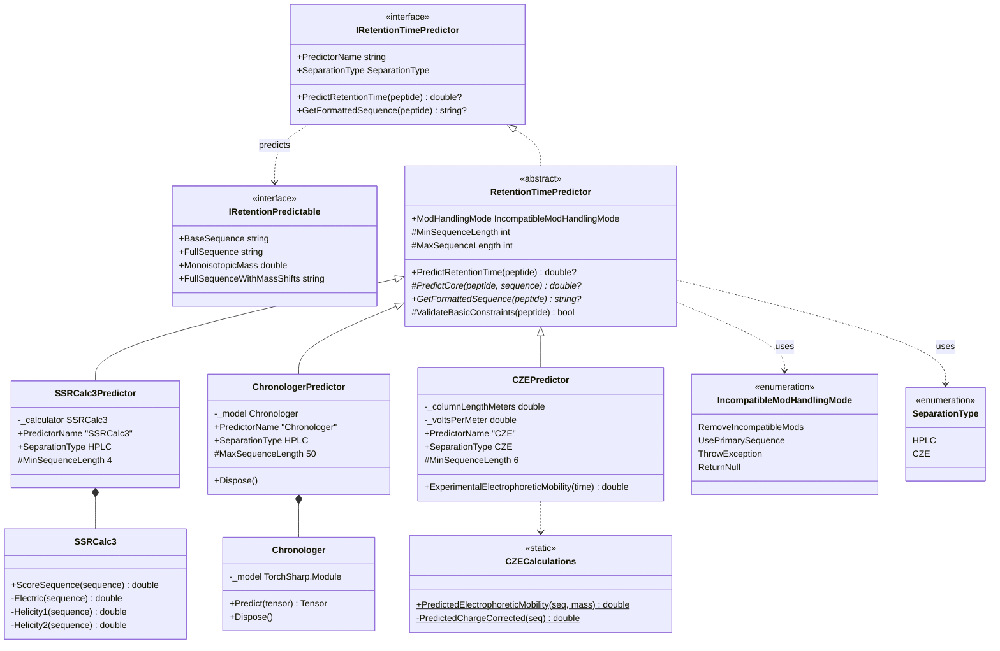
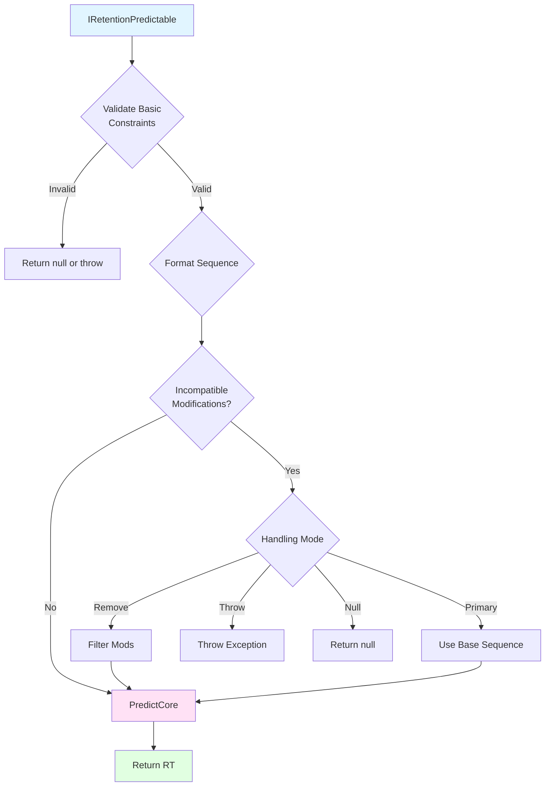

# Retention Time Prediction Infrastructure - Class Diagram

## Architecture Overview



## Component Summary

### Core Architecture

| Component | Type | Purpose |
|-----------|------|---------|
| **IRetentionPredictable** | Interface | Defines what can be predicted (implemented by `PeptideWithSetModifications`) |
| **IRetentionTimePredictor** | Interface | Contract for all RT predictors |
| **RetentionTimePredictor** | Abstract Base | Common validation, modification handling, and flow control |

### Predictors

| Predictor | Separation | Algorithm | Min/Max Length | Key Feature |
|-----------|------------|-----------|----------------|-------------|
| **SSRCalc3** | HPLC | Krokhin 2006 | 4+ residues | Uses base sequence only |
| **Chronologer** | HPLC | Deep Learning | ≤50 residues | Supports specific PTMs |
| **CZE** | CZE | Mobility 2017 | 6+ residues | Electrophoretic migration |

### Modification Handling

| Mode | Behavior |
|------|----------|
| **RemoveIncompatibleMods** | Strip unsupported modifications, predict with remaining |
| **UsePrimarySequence** | Ignore all modifications, use base sequence only |
| **ThrowException** | Fail with descriptive error |
| **ReturnNull** | Return null if incompatible modifications present |

## Prediction Flow



## Design Patterns

### Template Method
```
RetentionTimePredictor.PredictRetentionTime():
  1. ValidateBasicConstraints()
  2. GetFormattedSequence()      [abstract]
  3. PredictCore()                [abstract]
  4. Return result
```

### Strategy (Enum-based)
```
IncompatibleModHandlingMode determines behavior:
  - RemoveIncompatibleMods → Filter and predict
  - UsePrimarySequence     → Use base only
  - ThrowException         → Fail explicitly  
  - ReturnNull             → Silent failure
```

## Extension Guide

To add a new predictor:

```csharp
public class NewPredictor : RetentionTimePredictor
{
    // 1. Set properties
    public override string PredictorName => "NewPredictor";
    public override SeparationType SeparationType => SeparationType.HPLC;
    protected override int MinSequenceLength => 5;
    
    // 2. Implement formatting
    public override string? GetFormattedSequence(
        IRetentionPredictable peptide, 
        out RetentionTimeFailureReason? failureReason)
    {
        // Convert to predictor-specific format
    }
    
    // 3. Implement prediction
    protected override double? PredictCore(
        IRetentionPredictable peptide,
        string? formattedSequence)
    {
        // Your algorithm here
    }
}
```

## Key Dependencies

```
Chromatography (this project)
  ↓
  IRetentionPredictable
  ↓
Proteomics
  ↓
  PeptideWithSetModifications : IRetentionPredictable
```

## References

- **SSRCalc3**: Krokhin OV et al., *Anal. Chem.* 2006, 78(22):7785-95
- **Chronologer**: Searle Lab, harmonized peptide libraries
- **CZE**: Krokhin OV et al., *Anal. Chem.* 2017, 89(3):2000-08
